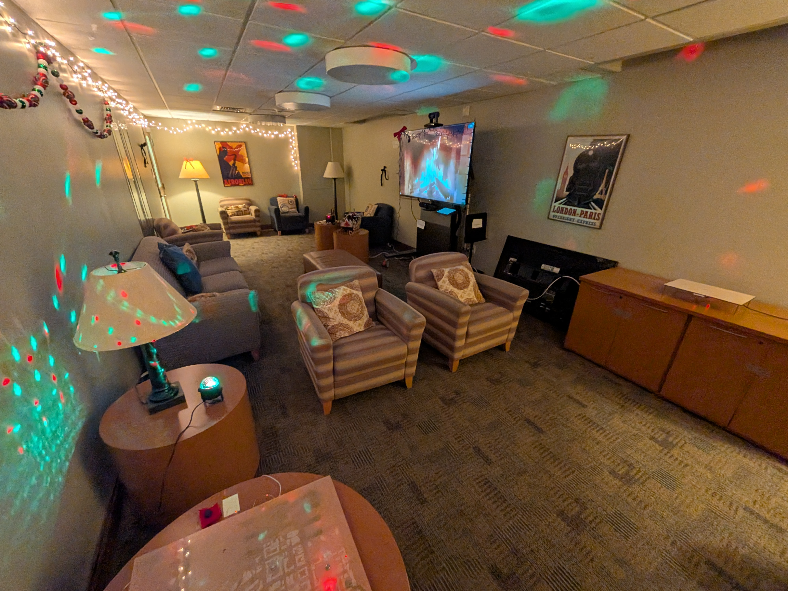
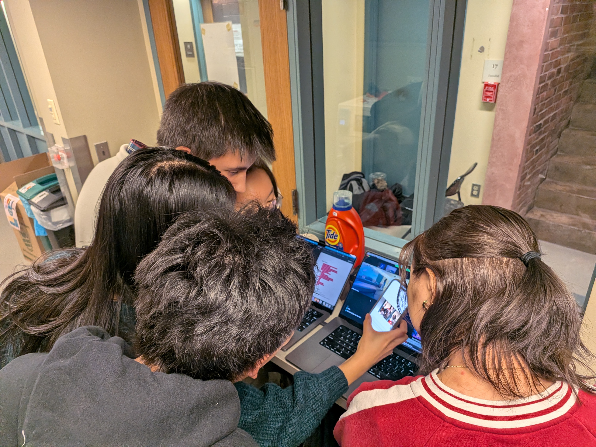
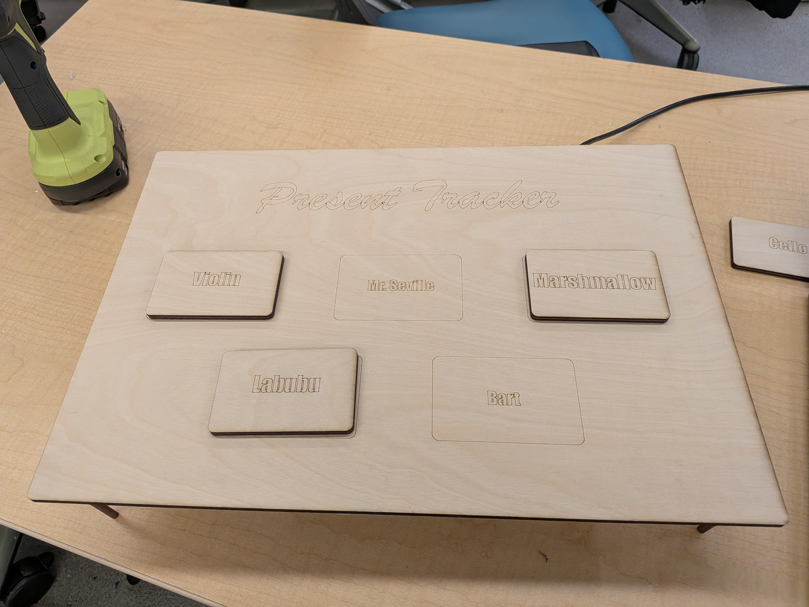
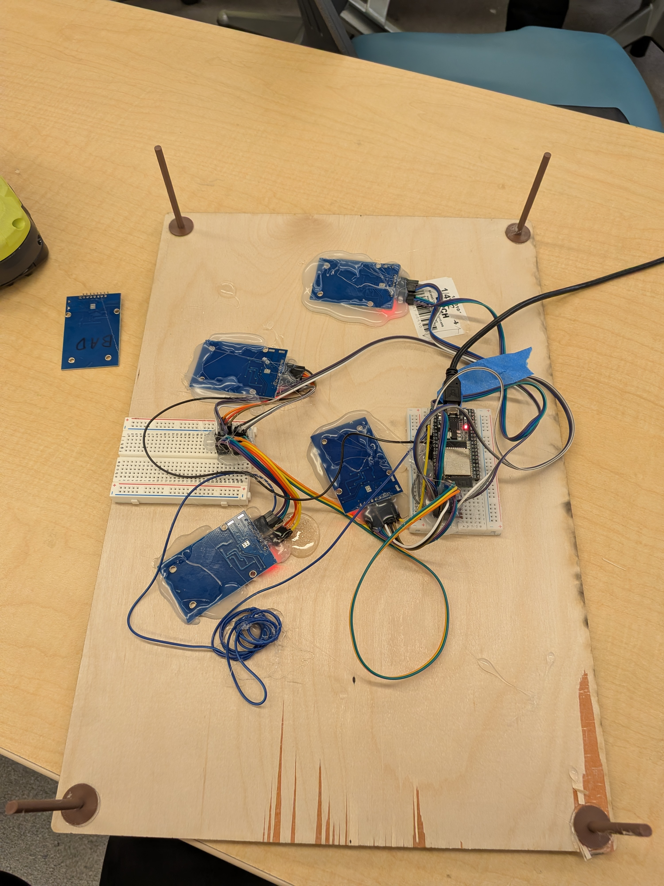

# ESCAPE 3340

ESCAPE 3340 was a one-day, holiday-themed, student-designed escape room for the Yale community. Participants had to solve electronic puzzles to escape, including an RFID "present matching" puzzle, a digital "power generator" puzzle, a Hall Effect-sensing wooden sleigh, and an interactive "naughty/nice map." Escape Room Designers watched from the control room, and were able to send commands to help/hinder escape room participants through a fully-networked interface.

At the end of the escape room, the _social deduction_ element was revealed to participants. The day before, one participant from each group was notified that they are "The Grinch," and were instructed to sabotage their group's progress. At the end of the escape room, participants were to vote out who they thought was The Grinch.

## Design and Concept Development
_Credits: Eric and Cindy_

Our first idea for a final project was to have an interactive, networked social deduction game, similar to an in-person version of _Among Us_. After discussion, we pivoted to a more classic escape room, but we retained the surprise element of an "impostor" reveal at the end of the game.

We spent time discussing various holiday-themes puzzles to implement that would both be technologically impressive and personal to Yale students. We wanted players to draw on their liberal arts education and critical thinking.

When designing the flow of the game, we wanted players to be able to "split up" and work on many different puzzles at once. So, we designed a "progression tree" that mapped out what prerequisites each puzzle has. We eventually came up with the below puzzles.

## Puzzle 1: Present Matching
_Credits: Eric_

First, players have to read five characters' "letters to Santa" that are placed around the room. They have to match up each character's name to the gift that they desire. To do this, they use logical deduction based on the letters to Santa and perhaps even previous knowledge about Christmas lore (lyrics to famous songs, etc). Players place wooden tokens written with the names of gifts to their corresponding spot on a small wooden board.

Technically, RFID sensors detect the presence of RFID tags on the back of each wooden token. Each RFID tag has a unique ID, so the program knows when the correct solution is tapped. When the players get it right, the puzzle sends a signal to the receipt printer to print out the code to a lock box that contains a "power cord" prop.

Some challenges were figuring out how the multi-device communication protocol worked. One of the RFID sensors never ended up working, which was a pain to debug since I thought that I had done something wrong. Also, we discovered that the sensors interfered with each other if too physically close.

## Puzzle 2: Turn On the Generator
_Credits: Alicia_

original plan: stranger things lights but didn't come in on time
put that aside, focused on the puzzle design/hardware
wanted to incorporate some type of conditional wheel (potentiometer)
a lot of escape rooms give hints but not in order so based on that, originally had maze idea but felt too simple
spent a lot of time designing the layered image, then divided full sketch into layers, vectorized then printed
kerf bend box to look nicer
potentiometer and number displayer (led) on same esp, only needs to be local but cindy and eric connected it to wifi and added the function of the spinning led when code is correct
magnet circle added to top so easier to hold (also on potentiometer led esp

## Puzzle 3: The Sleigh
_Credits: Lily_

## Puzzle 4: The Map
_Credits: Murad_

~[Map_Wiring_Diagram](./resources/mapwiring.png)

## Environmental Effects
_Credits: Cindy and Michael_

## Networking and Control Room
_Credits: Michael_

## Social Deduction: The Final Reveal

At the very end of the escape room, the players are told that one of them is _The Grinch_. Beforehand, one player from each grouup was selected as _The Grinch_, and told via email that they were to sabotage and hinder the group's progress. Once the group solves the final puzzle, they are given 2 minutes to deliberate and vote out _The Grinch_; if they are unsuccessful, they lose and _The Grinch_ wins.

## After-Experience Reflection

Despite small challenges during the experience, such as the receipt printer breaking and some wires getting unplugged, we were very happy with how the event turned out. Because of our failsafes, player communication features, and robust networking setup, we were able to diagnose and rectify glitches that came up without delaying any groups. We were also able to adjust the puzzles to an appropriate level of difficulty in response to player testing during the first few rounds.
