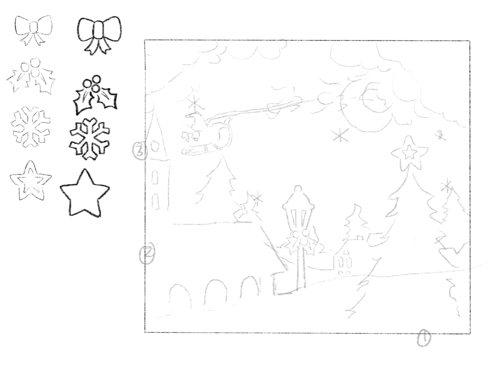
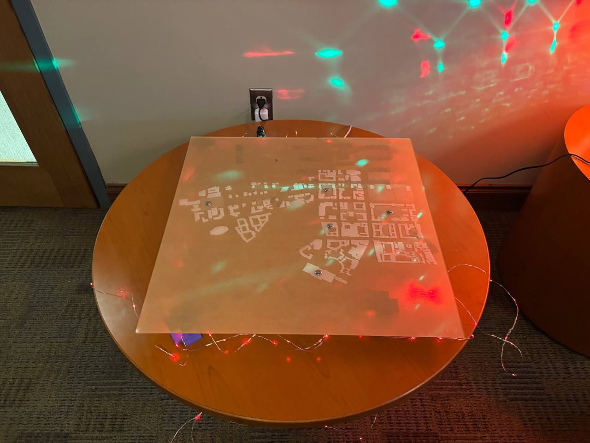
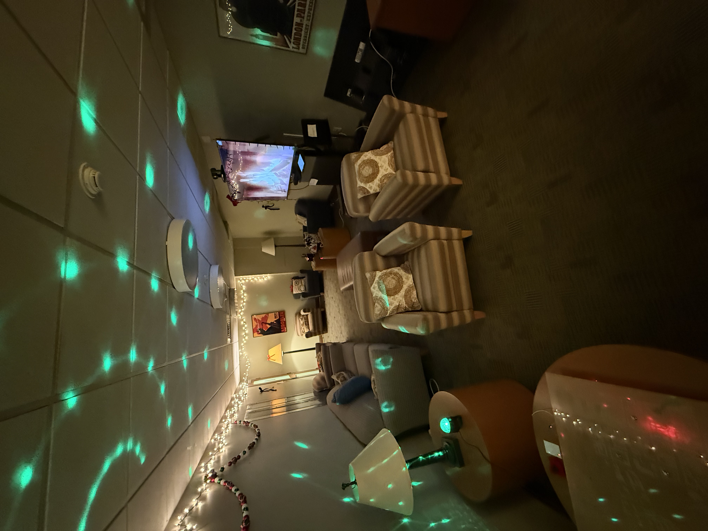
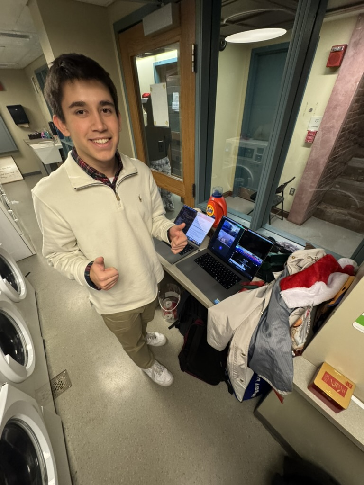

# ESCAPE 3340

ESCAPE 3340 was a one-day, holiday-themed, student-designed escape room for the Yale community. Participants had to solve electronic puzzles to escape, including an RFID "present matching" puzzle, a digital "power generator" puzzle, a Hall Effect-sensing wooden sleigh, and an interactive "naughty/nice map." Escape Room Designers watched from the control room, and were able to send commands to help/hinder escape room participants through a fully-networked interface.

At the end of the escape room, the _social deduction_ element was revealed to participants. The day before, one participant from each group was notified that they are "The Grinch," and were instructed to sabotage their group's progress. At the end of the escape room, participants were to vote out who they thought was The Grinch.

## Design and Concept Development
_Credits: Eric and Cindy_

Our first idea for a final project was to have an interactive, networked social deduction game, similar to an in-person version of _Among Us_. After discussion, we pivoted to a more classic escape room, but we retained the surprise element of an "impostor" reveal at the end of the game.

We spent time discussing various holiday-themes puzzles to implement that would both be technologically impressive and personal to Yale students. We wanted players to draw on their liberal arts education and critical thinking.

When designing the flow of the game, we wanted players to be able to "split up" and work on many different puzzles at once. So, we designed a "progression tree" that mapped out what prerequisites each puzzle has. We eventually came up with the below puzzles.

## Puzzle 1: Present Matching
_Credits: Eric_

First, players have to read five characters' "letters to Santa" that are placed around the room. They have to match up each character's name to the gift that they desire. To do this, they use logical deduction based on the letters to Santa and perhaps even previous knowledge about Christmas lore (lyrics to famous songs, etc). Players place wooden tokens written with the names of gifts to their corresponding spot on a small wooden board.

Technically, RFID sensors detect the presence of RFID tags on the back of each wooden token. Each RFID tag has a unique ID, so the program knows when the correct solution is tapped. When the players get it right, the puzzle sends a signal to the receipt printer to print out the code to a lock box that contains a "power cord" prop.

Some challenges were figuring out how the multi-device communication protocol worked. One of the RFID sensors never ended up working, which was a pain to debug since I thought that I had done something wrong. Also, we discovered that the sensors interfered with each other if too physically close.

## Puzzle 2: Turn On the Generator
_Credits: Alicia_

In order to turn on the generator, players have to input the correct 4-digit code into the keypad. All four numbers in the code are given, but out of order. Players must decipher the image attached to the generator to find the right order for the code. On the wheel, players can find four symbols, each of which appear once in the image as well. There is one symbol per layer of the image, giving the correct order of the symbols that correspond with each number. By finding the order of the symbols, players can turn the wheel in that order to see the respective numbers in order as well.

### Puzzle Design
I knew that I wanted to have the players figure out the order for the code. The original idea was to have a maze for players to solve with symbols throughout, and the order that the player arrives at the symbol gave the order for the code. However, that felt too simple, so I drew inspiration from escape rooms that I’ve been to in the past, where hints are less direct and require more attention for the idea of the layered image. 

I made a sketch of the full image before dividing it into layers.

### Wiring and LED Display
Since the lights we originally wanted to use to display corresponding numbers to symbols didn’t arrive on time, we pivoted to using an LED display instead. I was worried that the display required too many GPIO pins, but Cindy and Eric implemented it into my puzzle using only seven pins. 

The wheel was attached to a potentiometer, so when it turned, it sent a value to an ESP32, which then flashed the corresponding number on the display. Once the player enters the correct code, the lights in the display would start spinning (courtesy of Eric).

### Locality and Wifi
The potentiometer and LED display were originally planned to be on the same ESP32 that required no wireless connection, unlike the keypad and magnet detector. This is because the wheel and display’s only job was to give hints; no communication with the server was required, whereas the server needed to know if the correct code was inputted into the keypad in order to turn on the generator and activate the magnet detector. However, we ended up making both ESP32s wifi-capable. The potentiometer and LED display were on one ESP, while the magnet detector and keypad was on another (it had required 13 pins). The second ESP has power jumped from the first to power the entire puzzle. To the right is the wiring diagram that Cindy put together detailing the more specific connections that each part had.

## Puzzle 3: The Sleigh
_Credits: Lily_

[THE SLEIGH](./resources/sleigh.mov)

The wiring and software logic of this puzzle was relatively easy: when a magnet sensor senses a magnet, the pi sends a message to Michael's server which then sends back a command to turn on lights and the display screen via an esp-controlled relay. The pi is always on, running a 12-days-of-christmas gif I animated in Premiere Pro. The most difficult part was the physical making of the sleigh. For one, the first time I lazer-cut my sleigh, it caught on fire. Appparently, the lazer was cutting too slowly, so at areas where there was a lot of curves close together, the wood was overheated and caught on flames. It was fixed by running the board on the larger lazer cutter, which had a stronger power and increased cutting speed, so that I was able to reduce the cutting time from 44 minutes to 6 minutes. There was also a lot of testing around to mark the exact location where the magnet sensor always detects the magnet (since the magnet sensor is on the other side of the wood board). I also had to cut slightly into the sleight boards to fit in cables and wires. All-in-all, there was a lot of precision design in making a clean, durable enclosure that withheld innocent-participants' handling and exploring.

## Puzzle 4: The Map
_Credits: Murad_

The completion of the map was three parts: the physical map, the circuit design, and the programming integration to the networking. I used various tools online to extract the svg format of Yale's campus, used Adobe Illustrator to edit and remove the unneeded entities in the map, and laser-printed on acrylic. The circuit design was relatively straightforward, but soldering the buttons so that they could be used with the esp board took significantly longer. Each button represented a place on campus where the kid lives in the story. There was an interesting deployment problem when working with circuit boards on the acrylic: when the esp32 was on acrylic, there was some electrical discharge that affected and changed the values of the buttons. That took significantly longer to figure out, and I could finally diagnose the problem while debugging with Eric and Cindy. Next, we connected the map logic into Micheal’s networking module so that the environmental lights turned red when the participants solved the map.

## Environmental Effects
_Credits: Cindy and Michael_

There are two key components to the envriomental effects.

First, the receipt printer uses the ECSPOS library and runs a Python script on a RaspberryPi, which takes commands from a server that Michael runs on a seperate machine. It is responsible for printing all communication such a hints with the players, and is a method for dropping passwords or moving along the story line. Strings need to be formatted with code recognizable `\n` since strings sent over the server aren't parsed properly. Once the message is sent over the server, the according message prints on the printer. A second issue we ran into was getting the printer to run consistently since we kept running into USB port issues. What ultimately worked, was turning the physical printer on and off again. 

Second, a relay controls the lighting in the room. The relay contians is wired to an ESP, which switches the circuit betweeen a circuit of red lights and white lights. This is also connected to the server.

## Networking and Control Room
_Credits: Michael_

As explained previously, all of our devices were remotely controlled via a central server created in Python. The devices join by sending the server a unique identifier, which is then kept in a dictionary. From then on, any device (including the CLI utility on the server) can broadcast messages to specific recipients, causing things to happen in the room. The server also has an events setup, which controls pre-programmed, routine state needed throughout the progression of the escape room. In terms of development, most of the difficulties were standard to networking setups. I had to ensure that devices would automatically connect to the server on boot, but also reconnect if the server goes down and starts again. I also had to make sure that the message parsing was robust-enough to prevent crashes if faulty messages were sent.of your friends playing) 

I also designed the system so all devices were simple input/output only, with game logic being controlled exclusively via the server. The result was an incredibly user-friendly system, with device control being as simple as a CLI command. Because of the safety, we were event able to make last-minute changes without fail. For example, after a group accidentally solved the escape room early, we took down the server, pushed an update with new event code, and restarted it. The devices connected, and all continued running as planned.

The control room was composed of an incredibly jank setup in the Trumbull laundry room, right across from where all the escaping magic took place. I had two computers set up, one with the server, and the other with the Zoom and ambience settings. During the game, we were able to see all the progress players made, including failed and successful puzzle attempts, from the comfort of the washing machines. This was also where the players’ biggest help, the receipt printer, was controlled. As we watched and listened to the players from Eric’s Zoom, I would send hints on behalf of Santa to help move players along if they were stuck. Music was also manually controlled from Eric’s computer, including the jazz ambience, final Grinch music, and other instrumentals that we would occasionally play as hints for puzzles that required more musical or Christmas-related knowledge.

[The Control Room: Video](./resources/control_room.mov)

## Social Deduction: The Final Reveal

At the very end of the escape room, the players are told that one of them is _The Grinch_. Beforehand, one player from each grouup was selected as _The Grinch_, and told via email that they were to sabotage and hinder the group's progress. Once the group solves the final puzzle, they are given 2 minutes to deliberate and vote out _The Grinch_; if they are unsuccessful, they lose and _The Grinch_ wins.

## After-Experience Reflection

Despite small challenges during the experience, such as the receipt printer breaking and some wires getting unplugged, we were very happy with how the event turned out. Because of our failsafes, player communication features, and robust networking setup, we were able to diagnose and rectify glitches that came up without delaying any groups. We were also able to adjust the puzzles to an appropriate level of difficulty in response to player testing during the first few rounds.
